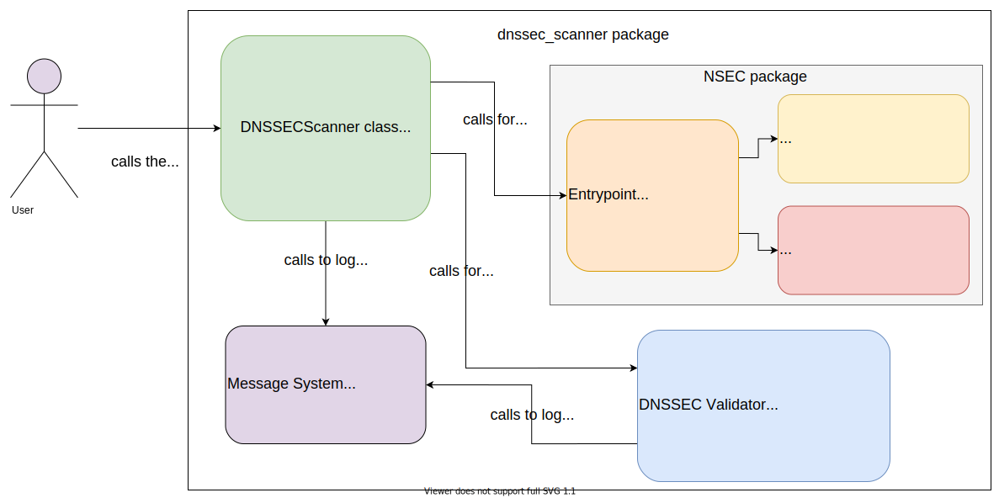

# Description

This DNSSEC scanner aims to provide a detailed description
of the DNSSEC domain validation process. It returns error messages
that can help to debug DNSSEC configuration.

## Features
1. Returns one of the three states: Secure, Insecure, Bogus
2. Returns log messages about the verification process
3. Warns about misconfiguration
4. Gives detailed error messages if the domain could not be
validated
5. Returns the protected and unprotected RR sets for the domain
name as ``dns.rrset.RRset`` types from ``dnspython``
6. Proof with NSEC or NSEC3 that a domain name does not exist
as well as that DNSSEC is not available in a zone

## Mechanics
- Starts at a root zone server and searches for an SOA record
- Validates the root zone KSKs with the DS record from 
[iana.org](https://data.iana.org/root-anchors/root-anchors.xml)
- Validates successive all KSKs, ZSKs and DS records from top to bottom
- If there is no DS record it tries to proof it with NSEC or NSEC3
- If the domain does not exist it also tries to proof it with NSEC 
or NSEC3
- If an SOA record is found it tries to find with a list and with a
"ANY" DNS query as many records as possible
- Then it tries to validate those records
- Return comprehensive logs, warnings and error messages in the
DNSSECScannerResult object
- The DNSSECScannerResult object also contains the status and all
found records divided into secure and insecure records

# Usage
## API usage
**Sample code**
```python
from dnssec_scanner import DNSSECScanner, DNSSECScannerResult

scanner = DNSSECScanner("www.ietf.org")
res = scanner.run_scan() # type: DNSSECScannerResult
print(res)
```

## Command-line interface usage
```shell script
$ dnssec-scanner www.ietf.org
```

## Output
```shell script
╒════╤════════════════════════════════════════════════════════════════════════════════════╕
│    │ Log                                                                                │
╞════╪════════════════════════════════════════════════════════════════════════════════════╡
│  0 │ . zone: KSK 20326 record validated, using DS 20326                                 │
├────┼────────────────────────────────────────────────────────────────────────────────────┤
│  1 │ . zone: DNSKEY 48903,33853,20326 record validated, using KSK 20326                 │
├────┼────────────────────────────────────────────────────────────────────────────────────┤
│  2 │ . zone: org. DS 9795,9795 record validated, using ZSK 33853                        │
├────┼────────────────────────────────────────────────────────────────────────────────────┤
│  3 │ org. zone: KSK 9795 record validated, using DS 9795                                │
├────┼────────────────────────────────────────────────────────────────────────────────────┤
│  4 │ org. zone: DNSKEY 33209,17883,37022,9795 record validated, using KSK 9795          │
├────┼────────────────────────────────────────────────────────────────────────────────────┤
│  5 │ org. zone: DNSKEY 33209,17883,37022,9795 record validated, using KSK 17883         │
├────┼────────────────────────────────────────────────────────────────────────────────────┤
│  6 │ org. zone: DNSKEY 33209,17883,37022,9795 record validated, using ZSK 33209         │
├────┼────────────────────────────────────────────────────────────────────────────────────┤
│  7 │ org. zone: ietf.org. DS 45586,45586 record validated, using ZSK 33209              │
├────┼────────────────────────────────────────────────────────────────────────────────────┤
│  8 │ ietf.org. zone: KSK 45586 record validated, using DS 45586                         │
├────┼────────────────────────────────────────────────────────────────────────────────────┤
│  9 │ ietf.org. zone: DNSKEY 40452,45586 record validated, using KSK 45586               │
├────┼────────────────────────────────────────────────────────────────────────────────────┤
│ 10 │ ietf.org. zone: DNSKEY 40452,45586 record validated, using ZSK 40452               │
├────┼────────────────────────────────────────────────────────────────────────────────────┤
│ 11 │ ietf.org. zone: www.ietf.org. CNAME record validated, using ZSK 40452              │
├────┼────────────────────────────────────────────────────────────────────────────────────┤
│ 12 │ . zone: KSK 20326 record validated, using DS 20326                                 │
├────┼────────────────────────────────────────────────────────────────────────────────────┤
│ 13 │ . zone: DNSKEY 48903,33853,20326 record validated, using KSK 20326                 │
├────┼────────────────────────────────────────────────────────────────────────────────────┤
│ 14 │ . zone: net. DS 35886 record validated, using ZSK 33853                            │
├────┼────────────────────────────────────────────────────────────────────────────────────┤
│ 15 │ net. zone: KSK 35886 record validated, using DS 35886                              │
├────┼────────────────────────────────────────────────────────────────────────────────────┤
│ 16 │ net. zone: DNSKEY 35886,24512 record validated, using KSK 35886                    │
├────┼────────────────────────────────────────────────────────────────────────────────────┤
│ 17 │ net. zone: cloudflare.net. DS 2371 record validated, using ZSK 24512               │
├────┼────────────────────────────────────────────────────────────────────────────────────┤
│ 18 │ cloudflare.net. zone: KSK 2371 record validated, using DS 2371                     │
├────┼────────────────────────────────────────────────────────────────────────────────────┤
│ 19 │ cloudflare.net. zone: DNSKEY 2371,34505 record validated, using KSK 2371           │
├────┼────────────────────────────────────────────────────────────────────────────────────┤
│ 20 │ cloudflare.net. zone: www.ietf.org.cdn.cloudflare.net. A record validated, using   │
│    │ ZSK 34505                                                                          │
├────┼────────────────────────────────────────────────────────────────────────────────────┤
│ 21 │ cloudflare.net. zone: www.ietf.org.cdn.cloudflare.net. AAAA record validated,      │
│    │ using ZSK 34505                                                                    │
╘════╧════════════════════════════════════════════════════════════════════════════════════╛
╒════╤════════════════════════════════════════════════════════════════════════════════════╕
│    │ Warnings                                                                           │
╞════╪════════════════════════════════════════════════════════════════════════════════════╡
│  0 │ All good ;)                                                                        │
╘════╧════════════════════════════════════════════════════════════════════════════════════╛
╒════╤════════════════════════════════════════════════════════════════════════════════════╕
│    │ Errors                                                                             │
╞════╪════════════════════════════════════════════════════════════════════════════════════╡
│  0 │ All good ;)                                                                        │
╘════╧════════════════════════════════════════════════════════════════════════════════════╛

Domain: www.ietf.org, DNSSEC: State.SECURE, Note: Found RR sets: A, AAAA
* not protected
```

# Architecture overview


